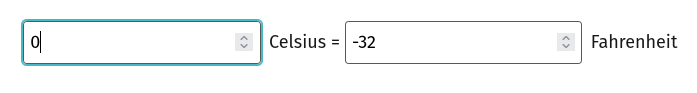
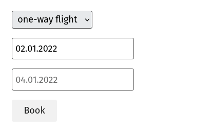
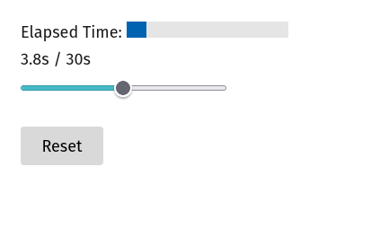
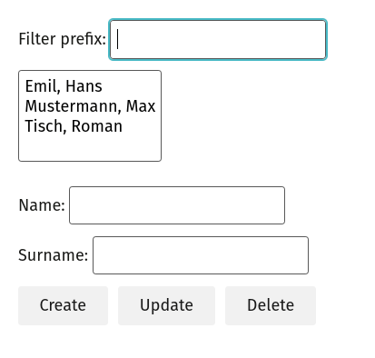
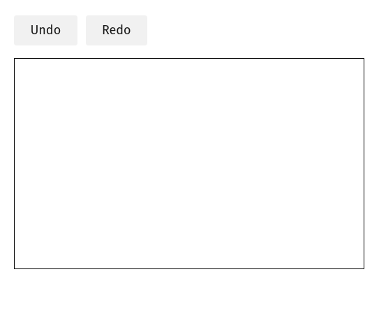

# 7GUIs With Svelte

## What Is 7GUIs

> The tasks were selected by the following criteria. The task set should be as small as possible yet reflect as many
> typical (or fundamental or representative) challenges in GUI programming as possible. Each task should be as simple and
> self-contained as possible yet not too artificial. Preferably, a task should be based on existing examples as that gives
> the task more justification to be useful and there already will be at least one reference implementation.

Source: https://eugenkiss.github.io/7guis/tasks/

## Why

I mainly worked in the backend spectrum, but wanted to have some fun with frontend stuff a bit.

## Getting Started

Make sure that you have `node` and `yarn` ready.

```shell
# to install dependencies
yarn install

# to start running the project
yarn dev

#   VITE v3.1.8  ready in 492 ms
#
#   ➜  Local:   http://127.0.0.1:5173/
#   ➜  Network: use --host to expose
```

Visit http://127.0.0.1:5173 to see the home page, and then go to the implemented tasks.

## Samples

### Counter


### Temperature Converter



### Flight Booker



### Timer



### CRUD



### Circle Drawer



### Cells

TBA
